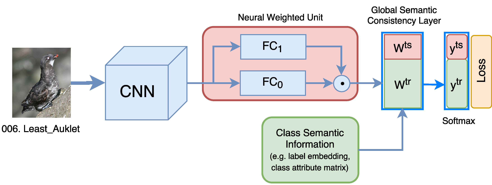
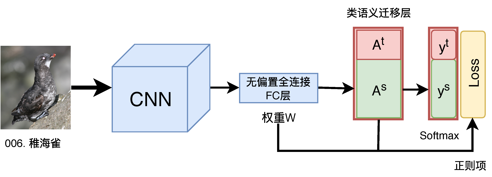
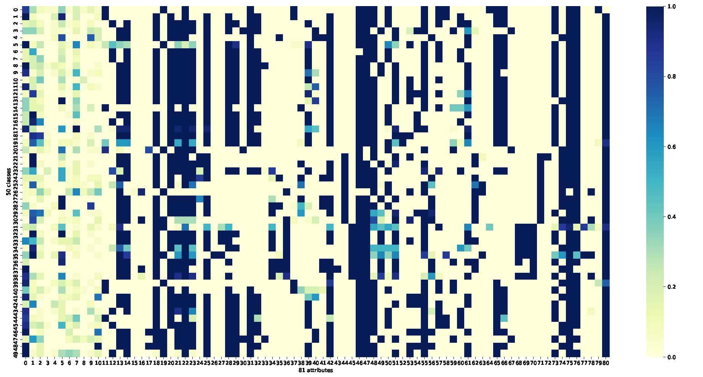
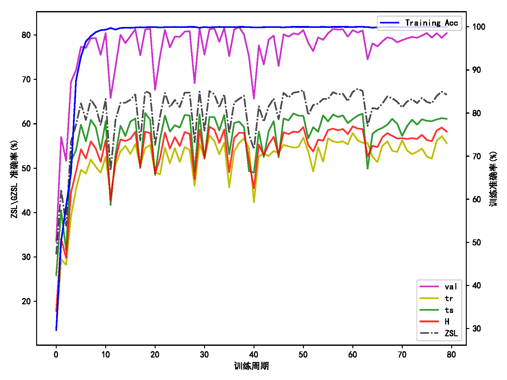

# AIChallenger2018_zsl
[AIChallenger2018_zsl](https://challenger.ai/competition/zsl2018)

### 赛题简介
本竞赛由创新工场、北京大学王亦洲教授和复旦大学付彦伟教授联合举办。

本次零样本学习（zero-shot learning）竞赛的任务是在已知类别上训练物体识别模型，要求模型能够用于识别来自未知类别的样本。
本次竞赛提供了属性，用于实现从已知类别到未知类别的知识迁移。要求参赛选手提交对测试样本的标签预测值。

### 数据说明
数据集分Test A和Test B两部分。Test A包含动物（Animals）、水果（Fruits）两个超类。Test B包含交通工具（Vehicles）、电子产品（Electronics）、发型（Hairstyles）三个超类。对于每个超类均包含训练集（80%类别）和测试集（20%类别）。训练集所有图片均标注了标签和包围框。对于部分图片（20张/类），标注了二值属性，属性值为0 或 1，表示属性"存在"或"不存在"。对于测试集中的未知类别，仅提供类别级的属性用作知识迁移。

### 零样本学习ZSL示意图
 

### adcv 方案介绍

1. Global Semantic Consistency Network (GSC-Net)
 

2. Attribute Balancing Network (ABN)
 

### Data Analysis(class attribute matrix)
#### vehicles
 

#### electronics
 

#### hairstyles
 


### Code Solution
Take vehicle for example:
1. Set dataset_dir, superclass etc.
```
dataset_dir "ai_challenger_zsl2018_test_b_20180423"
superclass = "vehicles"
python utils/dataUtils.py
```
2. train
```
GSC-Net: attrWCNNg (Default)
criterion = nn.CrossEntropyLoss()

ABN:  attrWCNNg1 (Set loss = criterion(out, targets, w))
criterion = RegLoss(lamda1=lamda1, lamda2=lamda2, superclass=superclass)

python zsl_train.py
```
1) Train only FC for first 2 epochs.
2) End to end train: Since the competition training images is enough,
we simply choose the 3rd epoch checkpoint as our final submission model.

GSC-Net often achieves high in the 3rd epoch.
ABN can be stable enough in the first 20 epochs.

3. prediction
```
python pred.py
```


### Results
We evaluate our model in open-access benchmark CUB on both ZSL and GZSL
task. Accuracies along with the training are shown below.

 

